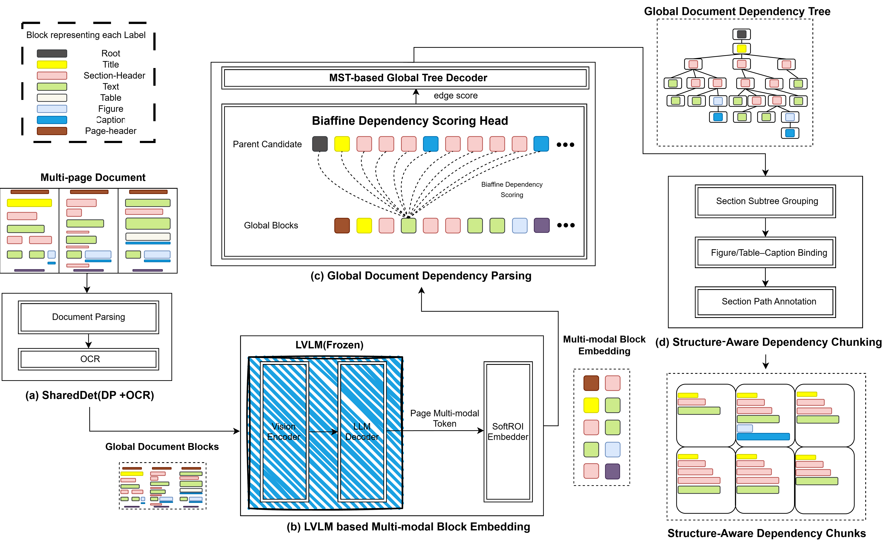

# M3DocDep

**M3DocDep: Multi-modal, Multi-page, Multi-document Dependency Chunking with Large Vision-Language Models**<br>
Joongmin Shin, Jeongbae Park, Jaehyung Seo, Heuiseok Lim<br>
*CVPR 2026*

[[Project Page](https://shinjm-maker.github.io/M3DocDep/)] [[Paper](https://openaccess.thecvf.com/content/CVPR2026/papers/Shin_M3DocDep_Multi-modal_Multi-page_Multi-document_Dependency_Chunking_with_Large_Vision-Language_Models_CVPR_2026_paper.pdf)] [[Supplementary](https://openaccess.thecvf.com/content/CVPR2026/supplemental/Shin_M3DocDep_Multi-modal_Multi-page_CVPR_2026_supplemental.pdf)] [[arXiv](https://arxiv.org/abs/2605.18774)] [[Publication Page](https://shinjm-maker.github.io/publications/m3docdep.html)]

M3DocDep uses large vision-language models to infer cross-page and cross-document dependency structures in complex unstructured documents. The resulting structure-aware multimodal chunks improve evidence retrieval and downstream question answering in retrieval-augmented pipelines.

<p align="center">
  
</p>

## About this repository

This repository hosts the source of the [project page](https://shinjm-maker.github.io/M3DocDep/), served with GitHub Pages from the `main` branch. The page is a single `index.html` file with images in `assets/`.

## Citation

```bibtex
@InProceedings{Shin_2026_CVPR,
    author    = {Shin, Joongmin and Park, Jeongbae and Seo, Jaehyung and Lim, Heuiseok},
    title     = {M3DocDep: Multi-modal, Multi-page, Multi-document Dependency Chunking with Large Vision-Language Models},
    booktitle = {Proceedings of the IEEE/CVF Conference on Computer Vision and Pattern Recognition (CVPR)},
    month     = {June},
    year      = {2026},
    pages     = {16603-16613}
}
```

## Acknowledgment

The project page template is adapted from [Nerfies](https://github.com/nerfies/nerfies.github.io) and is licensed under [CC BY-SA 4.0](http://creativecommons.org/licenses/by-sa/4.0/).
